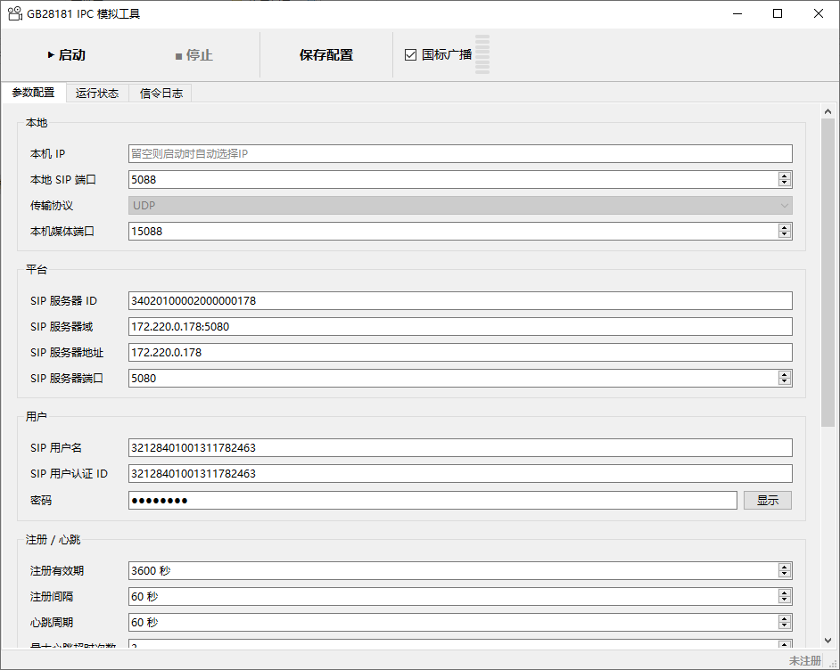

# GB28181 IPC 模拟工具

一个解压即用的GB28181 IPC模拟程序

## 1. 简介

本工具是一个在 **Windows 10 / 11** 上运行的**国标（GB/T 28181-2016）IPC 模拟器**。在没有真实摄像机的情况下，它可以向国标平台模拟一台网络摄像机（IPC）的行为：

- **注册**：向平台发起 Digest 摘要认证注册，并周期性刷新；
- **心跳**：按设定周期发送 Keepalive，维持在线状态；
- **查询应答**：响应平台下发的设备信息 / 设备状态 / 设备目录（Catalog）查询；
- **实时点播**：被平台点播时，把 **PS 视频流**通过 RTP 推送给平台，收到停止指令后停流；
- **国标语音广播（可选）**：作为语音输出设备，接收平台下发的语音广播并在本机播放。

---

## 2. 运行与启动

本工具**自包含、无需安装**，也不会向系统目录写入任何内容。

1. 将整个 `GB28181_IPC模拟工具` 文件夹拷贝到目标机器任意位置；
2. 双击 `GB28181_IPC模拟工具.exe` 即可启动。

---

## 3. 界面与基本操作

程序窗口由**三个页签**和**顶部工具条**组成。

**工具条**（从左至右）：

| 控件 | 作用 |
|---|---|
| `▶ 启动` | 按当前配置启动设备（注册 + 心跳 + 待命） |
| `■ 停止` | 停止设备，后台完成注销后界面自动复位 |
| `保存配置` | 把当前「参数配置」页的参数写入配置文件 |
| `国标广播`（勾选框）+ 音量条 | 启用/关闭语音广播，勾选后显示实时音量（见 §5） |

**三个页签**：

| 页签 | 内容 |
|---|---|
| **参数配置** | 填写本机 / 平台 / 设备 / 注册心跳 / 媒体 / 设备信息等参数 |
| **运行状态** | 注册状态、设备 ID、本机/平台地址、心跳、呼叫状态、推流统计、广播状态 |
| **信令日志** | 滚动日志，支持关键字过滤、自动滚动、暂停、清空、导出（失败/异常红色、告警橙色、成功绿色） |

**基本使用流程**：

1. 在「参数配置」页填写平台与设备参数（见 §4）；
2. 点击 `▶ 启动`，观察「运行状态」页的**注册状态**变为「在线」（右下角状态栏同步显示）；
3. 平台点播本设备时，「运行状态」页的**呼叫状态 / 推流统计**会实时刷新；
4. 点击 `■ 停止` 结束运行（界面自动复位）。

---

## 4. 参数填写说明

「参数配置」页按分组组织，常用参数说明如下（**括号内为默认值**）：

### 本地
| 参数 | 说明 |
|---|---|
| 本机 IP | 一般**留空**，程序启动时按到平台的网络路由自动探测出网卡 IP |
| 本地 SIP 端口 | 本机 SIP 信令端口（默认 `5060`，UDP） |
| 本机媒体端口 | 本机发送媒体流的源端口（默认 `15060`） |

### 平台
| 参数 | 说明 |
|---|---|
| SIP 服务器 ID | 平台 SIP 服务器 ID（20 位数字，默认 `34020100002000000178`） |
| SIP 服务器域 | 形如 `IP:端口`（默认 `172.220.0.178:5080`） |
| SIP 服务器地址 | 平台实际 IP（默认 `172.220.0.178`） |
| SIP 服务器端口 | 平台 SIP 端口（默认 `5080`） |

### 设备
| 参数 | 说明 |
|---|---|
| SIP 用户名 | 本设备 ID（20 位数字，第 11–13 位 `132` 表示 IPC 类型，默认 `32128401001311782461`） |
| SIP 用户认证 ID | 认证 ID，多数平台与设备 ID 一致 |
| 密码 | 注册摘要认证密码（默认 `12345678`） |

### 注册 / 心跳
| 参数 | 说明 |
|---|---|
| 注册有效期 | 注册刷新周期（秒，默认 `3600`，国标要求 ≥ 3600） |
| 注册间隔 | 注册失败后的重试间隔（秒，默认 `60`，≥ 60） |
| 心跳周期 | Keepalive 发送周期（秒，默认 `60`） |
| 最大心跳超时次数 | 连续心跳超时达此值即判定平台离线并重注册（默认 `3`） |

### 媒体
| 参数 | 说明 |
|---|---|
| PS 流文件 | 点播时推送的素材（默认 `resource/ps_samples/HK264.ps`，可用「浏览…」选择） |
| 循环播放 | 勾选后素材循环推送（默认勾选） |

### 设备信息（应答平台查询时上报的内容）
| 参数 | 说明 |
|---|---|
| 设备名称 | 默认 `GBIPC-Simulator` |
| 厂商 | 默认 `Simulator` |
| 型号 | 默认 `GBIPC-SIM-1000` |
| 固件版本 | 默认 `V1.0.0` |
| 通道号 | 默认 `1` |
| 行政区划码 | 6 位行政区划代码，默认 `340201` |

> 不确定平台参数时，请向平台管理员索取「参数配置」信息（服务器 ID / 域 / 地址 / 端口、设备 ID、密码等）。

---

## 5. 国标语音广播（可选功能）

本工具可作为**语音输出设备**，接收平台的语音广播并在本机播放，同时实时显示音量。

**启用方式**：

1. 在工具条「保存配置」右侧勾选 **`国标广播`** 勾选框，其右侧出现**音量条**；
2. 勾选**仅停止状态下可修改**，设备启动后自动灰化；
3. 改动需点击 `保存配置` 写入配置文件后，下一次启动生效。

**工作流程（设备侧）**：平台下发广播通知 → 设备回 200 OK → 设备主动出呼拉取语音流 → 本机播放并实时显示音量 → 平台结束广播后链路释放、音量条复位。

**注意事项**：

- 仅支持 **PCMA（G.711A，8 kHz 单声道）** 语音；平台协商其他编码时本工具会记录日志并按裸 PCMA 处理；
- 语音广播（收流）与实时点播（推流）走不同呼叫，**可同时进行**；
- 无音频设备的机器上会自动降级为「只收流不出声」，**音量条仍正常工作**；
- 广播的高级参数（音频接收端口、抖动缓冲、播放增益、入流超时）位于配置文件的 `[broadcast]` 段，一般用默认值即可。

---

## 6. 替换视频素材

点播时推送的画面来自 `resource/ps_samples/` 目录下的 PS 流文件（打包后位于 exe 同级的 `resource\ps_samples\`），可直接增删替换，**无需重新打包**。

| 文件 | 说明 |
|---|---|
| `HK264.ps` | 海康 H.264 视频（**默认**，真实设备抓流） |
| `HK265.ps` | 海康 H.265 视频 |

如需更换出图内容，把含视频的 PS 文件放入该目录，并在「参数配置 → 媒体 → PS 流文件」中选择即可；发送器会自动识别音/视频帧，无需改动其他设置。

> 若平台能收到媒体流但**不出图**，多半是素材只有音频——请换成含视频 PES 的 PS 文件。

---

## 7. 能力边界

**已实现并验证**：

- 注册 / 注销（Digest 摘要认证）
- Keepalive 心跳与超时重注册
- 设备信息 / 设备状态 / 设备目录查询应答
- 实时点播受理与 PS 流推送（UDP / TCP 两种媒体传输），收到停止指令后停流
- 国标语音广播（可选，接收并播放 PCMA 语音）

**当前不支持**：

- **历史回放 / 下载**：收到非「实时视频点播」的呼叫会被拒绝；
- 广播仅支持 **PCMA（G.711A）** 编码；
- 单窗口仅模拟**一台**设备；需同时模拟多台时，请运行多个程序副本；
- SIP 信令固定使用 **UDP**。

